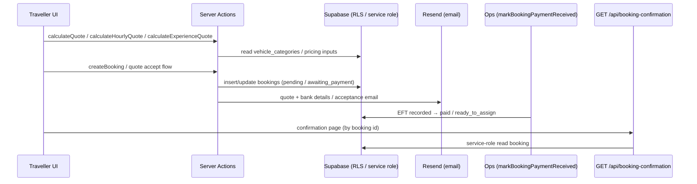

# Core traveller flow parity (CORE.6.4 / Story 6.4)

**Living artifact** for **[Epic 6](epic-6.md)** **CORE.6.4** — **search → quote → persist booking → email-with-bank-details → ops-mark (EFT) → confirmation hooks** in **Vestroo** terms (**Epic 1** traveller outcomes, **VST-6**, **VST-13**). **Theme N (Epic 16):** hosted checkout / PayFast-driven paid transitions are **removed**; authoritative settlement is **EFT** + **`markBookingPaymentReceived`** on the ops side — see **[Epic 16](epic-16.md)**.

## Scope

This document describes the **traveller** vertical slice only. It does **not** replace **[Front-end API interaction](front-end-api-interaction.md)** (authoritative Server Actions, Route Handlers, **quote integrity**, **idempotency**, and **Data flow**). It does **not** duplicate **[Capstone Nest REST → Vestroo mapping](capstone-nest-rest-to-vestroo-mapping.md)** (**BE.6.3**) per-controller tables. **Staff dispatch** (**`assignBookingToRun`**, **`/ops/*`**, **VST-7**) is referenced only where needed to explain **when** **`trips`** / **`booking_trips`** appear relative to **guest booking completion**.

**NFR.3.1:** **RLS** and **server-only** secrets govern data access; this doc must **not** be read as **client-trusted** payment or quote authority.

---

## End-to-end flow (numbered steps)

1. **Search / discovery (traveller)** — User picks **point-to-point**, **hourly hire**, **corporate pattern**, or **experience package** in the **marketing / booking wizard** (UI under `src/app/`). There is **no** Vestroo port of the reference Nest **`GET /search`** contract; discovery is **App Router** UX + validation, not an internal REST search API.
2. **Quote** — Server Actions **`calculateQuote`** (point-to-point + Distance Matrix), **`calculateHourlyQuote`**, or **`calculateExperienceQuote`** return **illustrative** options; **`src/lib/pricing-data.ts`** reads **`vehicle_categories`** / tiers. **Authoritative** persisted amounts come from **server reconciliation** at booking creation / quote acceptance — see **Quote integrity** in **[front-end-api-interaction.md](front-end-api-interaction.md)**.
3. **Persist booking (pre-settlement)** — **`createBooking`** inserts or updates **`public.bookings`** with **`payment_status`**, **`payment_reference`** (**`VST-*`** customer ref), **`booking_intent`**, guest fields, etc. Walk-in **quote-first** paths transition to **`awaiting_payment`** after the customer accepts via **`/q/[token]/accept`** and receive **EFT** instructions by email — not a gateway redirect. Details:**[Data models — Web bookings (`public.bookings`) — VST-6](data-models.md)**.
4. **Email-with-bank-details** — Quote and acceptance emails include **bank account**, **payment reference**, and amount (`sendWalkInQuote`, walk-in acceptance confirmation). The customer pays **out of band** (EFT).
5. **Ops-mark (EFT settled)** — **`markBookingPaymentReceived`** (**Theme N / US-N3**) transitions **walk-in** **`awaiting_payment` → `ready_to_assign`** and **account** **`invoiced` → `paid`** when ops records evidence; **`ops_audit_log`** captures **`payment_received_eft`**. See **[integrations-and-payments.md](integrations-and-payments.md)** **§ INT.8.3**.
6. **Confirmation hooks** — Customer-facing confirmation continues to use **`GET /api/booking-confirmation?id=<uuid>`** where applicable (**unguessable capability**; **service role** read) per **[front-end-api-interaction.md](front-end-api-interaction.md)** Route Handlers table. Paid-transition emails are driven by product rules post-settlement (not PayFast ITN).
7. **Post-purchase “manage”** — **`searchBooking`** (reservation **`payment_reference`** + phone) for **manage booking** flows; **`cancelBooking`** where allowed.

**`booking_trips` / `trips`:** The **web wizard does not** create **`booking_trips`** or **`trips`** rows at checkout. Those attach at **ops dispatch / fulfilment** (e.g. **`assignBookingToRun`** in **`src/actions/opsDispatch.ts`**, **VST-7**). Confirmed in **[front-end-api-interaction.md](front-end-api-interaction.md)** **Data flow** and **[data-models.md](data-models.md)** § **`booking_trips` / `trips` (web scope)**.

### Optional sequence (Mermaid)

---

## Reference modules → flow steps → Vestroo surfaces

| Nest domain module | Flow step(s) | Vestroo surface | Staff analogue (if any) |
| ------------------ | ------------ | --------------- | ------------------------ |
| **`SearchModule`** | 1 (discovery); 7 (manage lookup) | **No** Nest-shaped **`/search`** API — wizard UX + **`calculateQuote`** path; **`searchBooking`** for manage | **`/ops/search`**, **`/ops/fulfil`** — **RSC** + Supabase (staff discovery, not traveller REST) |
| **`PricingModule`** | 2 | **`calculateQuote`**, **`calculateHourlyQuote`**, **`calculateExperienceQuote`** | Ops pricing context via fleet/quote reads (no dedicated Nest **`/pricing`** port) |
| **`BookingModule`** | 3, 7 | **`createBooking`**, **`cancelBooking`**, **`searchBooking`**; staff:**`opsDispatch.ts`**, etc. | **`/ops/fulfil`**, **`/ops/trips`**, **`/ops/board`**, **`/ops/calendar`** |
| **`TripModule`** | *after* settlement (fulfilment) | **Guest flow:** **no** **`trips`** row yet. **`assignBookingToRun`**, **`updateTripStatusAction`**, … (**VST-7**) | Same ops routes; **[front-end-api-interaction.md](front-end-api-interaction.md)** **Data flow** |
| **`CheckoutModule`** | 4–6 | **`markBookingPaymentReceived`** (ops); quote emails + **`/q/[token]/accept`** EFT landing; **`GET /api/booking-confirmation/route.ts`** | Settlement is **staff-confirmed EFT**, not a third-party hosted checkout |

**HTTP-level Nest mapping (context only):** **[capstone-nest-rest-to-vestroo-mapping.md](capstone-nest-rest-to-vestroo-mapping.md)**.

---

## Idempotency, failures, and reference gaps

### Vestroo behaviour (link-only summary)

- **Quote reconciliation:** Client **`quoteAmount`** is **never** trusted for persistence — **`reconcileBookingQuote`** enforces server-side ZAR (**[front-end-api-interaction.md](front-end-api-interaction.md)** **Quote integrity**).
- **EFT settlement:** **`markBookingPaymentReceived`** enforces expected amounts (with variance rules), idempotent re-marks when already terminal, and audit logging — **[integrations-and-payments.md](integrations-and-payments.md)** **§ INT.8.3**.
- **Email:** Booking communications and bank-detail templates — **[integrations-and-payments.md](integrations-and-payments.md)** (**INT.8.1**).

### Reference Nest (honest gaps)

A search under **`docs/capstone-reference/backend/src/modules/{search,pricing,booking,trip,checkout}/`** for **`idempot`**, **`webhook`**, **`retry`**, and **`duplicate`** (case-insensitive) found **no** controller-level documentation of **payment webhook idempotency** or **ITN retry** semantics comparable to Vestroo. The only **`duplicate`** hit in that tree was **`trip.service.ts`** (“Time has duplicate with some trip”) — **scheduling conflict**, not payment idempotency.

**Conclusion:** **Idempotency** and **payment failure** expectations for the product are **Vestroo-docs-led** (**front-end-api-interaction**, **integrations-and-payments**, **`markBookingPaymentReceived`**, quote/ops actions), **not** inferred from the vendored **Mongo/Nest** reference.

---

## Related documentation

* **[Front-end API interaction](front-end-api-interaction.md)** — **Server Actions** table, **Route Handlers**, **Quote integrity**, **Idempotency**, **Data flow**
* **[Data models](data-models.md)** — **`public.bookings`**, **`payment_reference`**, **`trans_id`**, **`payment_status`**, lifecycle tables
* **[Integrations and payments](integrations-and-payments.md)** — **VST-13**, **§ INT.8.3** (Theme N settlement)
* **[Epic 16](epic-16.md)** — Theme N PayFast removal & EFT workflow
* **[Capstone Nest REST → Vestroo mapping](capstone-nest-rest-to-vestroo-mapping.md)** — **BE.6.3**
* **[Capstone backend module matrix](capstone-backend-module-matrix.md)** — **BE.6.1** domain rows (**Search**, **Pricing**, **Booking**, **Trip**, **Checkout**)
* **[Epic 1](epic-1.md)** — traveller booking UX narrative
* **[Epic 6](epic-6.md)** — **CORE.6.4**; **[Epic 6 — BE.6.7](epic-6.md#be67-data-and-server-actions-for-staff-ops-fe511)** — staff ops matrix rows point here for the **traveller** chain
